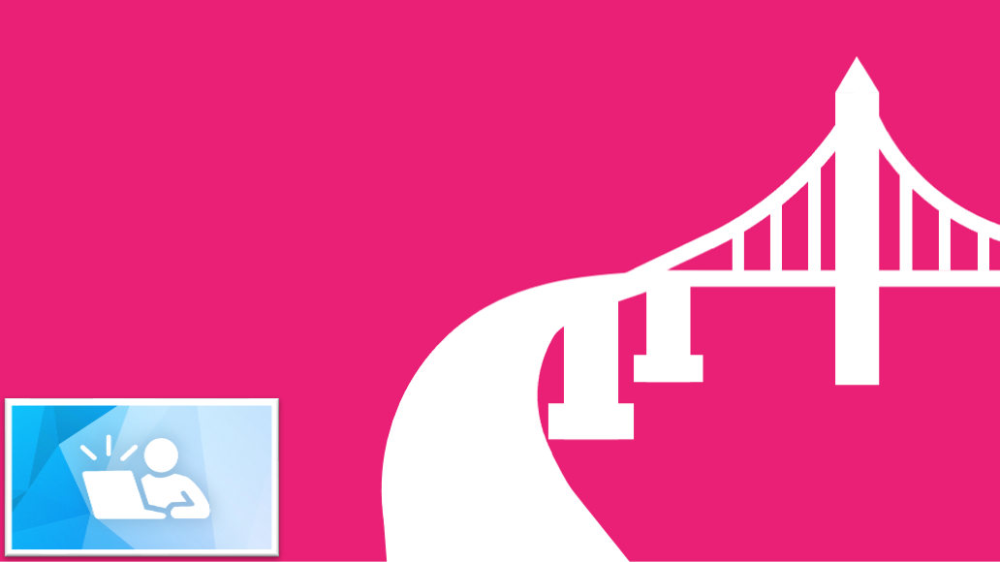
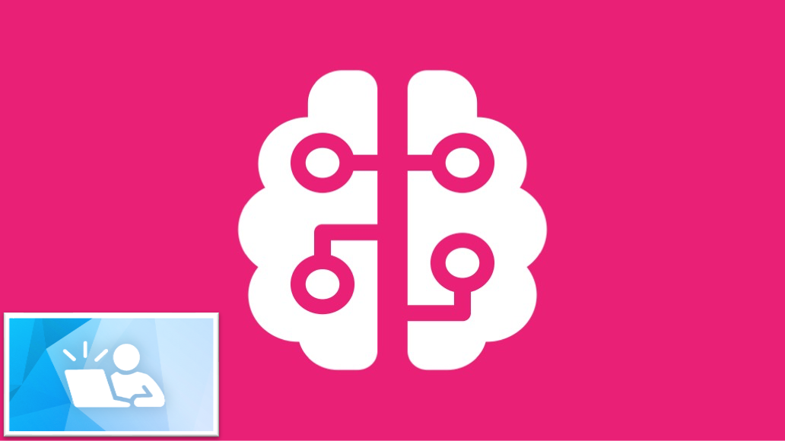

# Arcus Virtual Library

Arcus Education provides training and guidance to empower CHOP researchers and others who want to learn about Arcus or acquire skills related to data analytics and data science. 

## Getting Started in Arcus Labs

We have created a Quick Start guide for you to get started learning about Arcus Labs. [Click here to access the Quick Start guide](https://liascript.github.io/course/?https://raw.githubusercontent.com/arcus/Arcus_Labs_Orientation/refs/heads/main/arcus_quickstart.md#1). 

## Proposing a scientific project with Arcus

Once you have [drafted your project aims](https://forum.arcus.chop.edu/t/tips-for-writing-project-aims-as-part-of-a-new-arcus-scientific-project/486) and [defined your cohort](https://forum.arcus.chop.edu/t/tips-for-writing-a-cohort-definition-as-part-of-a-new-arcus-scientific-project/487), you will also need to evaluate any other resources you might need to complete the work you have planned. 

An Arcus lab is a computational environment where your selected data is delivered, usually in the form of a SQL dataset, and where you can use tools like RStudio, Jupyter, and a code editor to perform analysis in R or Python. As this is a primarily do-it-yourself model, you'll need one of the following: 

- Experience in SQL and your programming language of choice (R, Python, bash, etc.)
- The strong desire and the necessary bandwidth to learn these skills
- The funding to hire an analyst with the necessary skills (on your own or through [CoRU](https://arcus.chop.edu/#additional-dbhi-resources))

Check out [this post about the skills and knowledge required for an Arcus project](https://forum.arcus.chop.edu/t/what-skills-and-knowledge-are-required-for-an-arcus-project/973). If you find that you are missing some of these skills, you will either need to take the time to learn them or hire additional help.  

## Online training

Arcus Education provides data science training modules on Workday Learning, and we continue to add more (keep an eye out for our logo!). 

**How to work in an Arcus lab**

[Arcus On-Ramp](https://wd5.myworkday.com/chop/learning/program/ef63464e66e9100158d2d5f790160000?type=2d29754fdb8e100008b50ff6bc94003b)

**General data-science training**

[Arcus SQL Series](https://wd5.myworkday.com/chop/d/inst/1$23455/23455$3729.htmld?type=9882927d138b100019b928e75843018d)

[Arcus R Basics](https://wd5.myworkday.com/chop/d/inst/1$23455/23455$3732.htmld?type=9882927d138b100019b928e75843018d)
